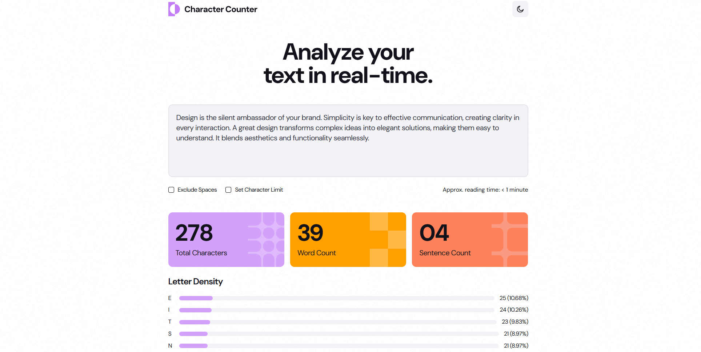

# Frontend Mentor - Character counter solution

This is a solution to the [Character counter challenge on Frontend Mentor](https://www.frontendmentor.io/challenges/character-counter-znSgeWs_i6). Frontend Mentor challenges help you improve your coding skills by building realistic projects.

## Table of contents

- [Overview](#overview)
  - [The challenge](#the-challenge)
  - [Screenshot](#screenshot)
  - [Links](#links)
- [My process](#my-process)
  - [Built with](#built-with)
  - [What I learned](#what-i-learned)
  - [Continued development](#continued-development)
  - [Useful resources](#useful-resources)
- [Author](#author)

## Overview

### The challenge

Users should be able to:

- Analyze the character, word, and sentence counts for their text
- Exclude/Include spaces in their character count
- Set a character limit
- Receive a warning message if their text exceeds their character limit
- See the approximate reading time of their text
- Analyze the letter density of their text
- Select their color theme
- View the optimal layout for the interface depending on their device's screen size
- See hover and focus states for all interactive elements on the page

### Screenshot



### Links

- Solution URL: [Add solution URL here](https://your-solution-url.com)
- Live Site URL: [Add live site URL here](https://your-live-site-url.com)

## My process

### Built with

- Semantic HTML5 markup
- CSS custom properties
- Flexbox
- CSS Grid
- Mobile-first workflow
- JavaScript

### What I learned

Regular Expressions

```js
function calcTotalCharacters(text, excludeSpaces) {
  if (excludeSpaces) {
    const regexp = /\s/g;
    return text?.replaceAll(regexp, "")?.length ?? 0;
  } else {
    return text?.length ?? 0;
  }
}

function calcTotalWords(text) {
  const regexp = /\b\w+\b/gi;
  return text?.match(regexp)?.length ?? 0;
}

function calcTotalSentences(text) {
  const regexp = /[^.?!]*[.?!]/g;
  return text?.match(regexp)?.length ?? 0;
}
```

### Useful resources

- [The Modern JavaScript Tutorial](https://javascript.info/) - Quick and easy to understand JavaScript tutorial.
- [MDN](https://developer.mozilla.org/en-US/docs/Web) - HTML and CSS quick reference

## Author

- Website - [jezzydev](https://github.com/jezzydev)
- Frontend Mentor - [@jezzydev](https://www.frontendmentor.io/profile/jezzydev)
